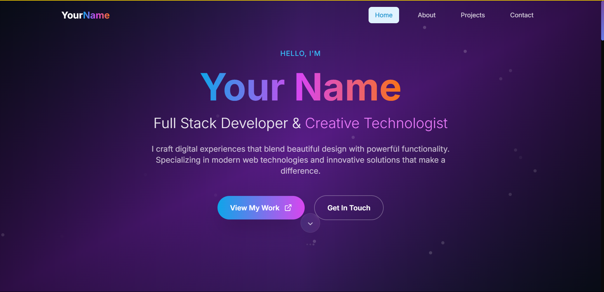
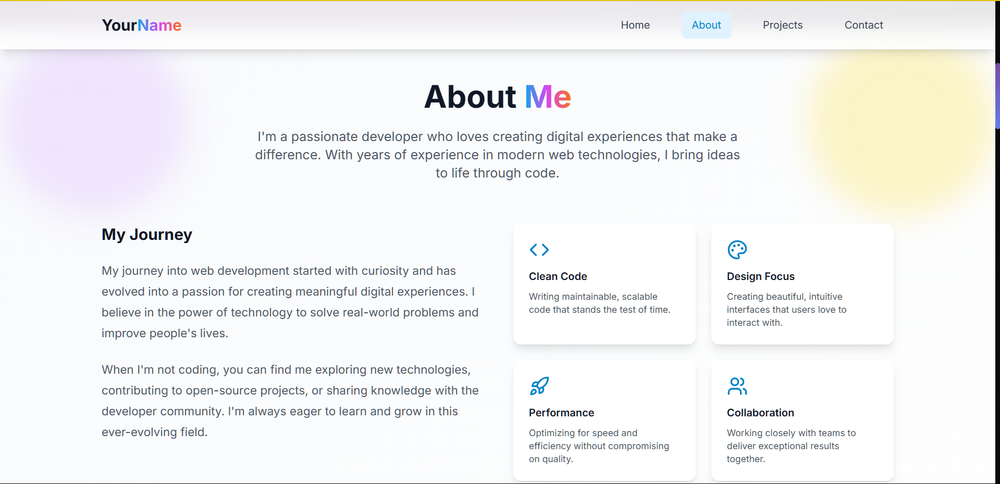
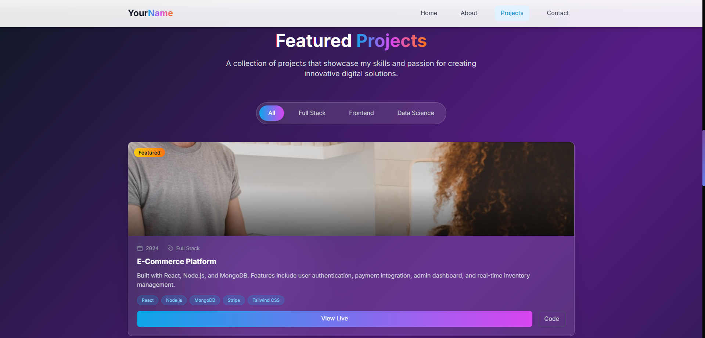
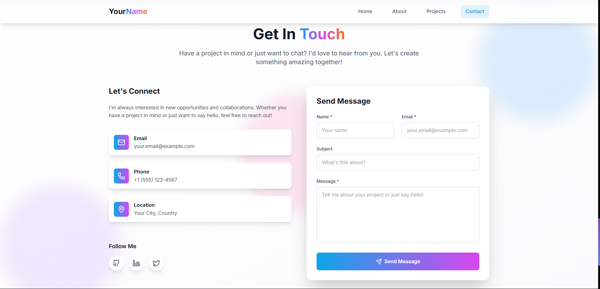

<div align="center">

# 🌟 Developer Portfolio Template 🌟

### *A Stunning React Portfolio Template with 3D Elements & Modern Design*

**Created with ❤️ by [Ram Sharma](https://github.com/ramsharma) for the developer community**

---

[](https://reactjs.org/)
[](https://www.typescriptlang.org/)
[](https://vitejs.dev/)
[](https://tailwindcss.com/)
[](https://threejs.org/)
[](https://www.framer.com/motion/)

[](LICENSE)
[](CONTRIBUTING.md)
[](https://github.com/ramsharma/dev-portfolio/stargazers)

---

## 🚀 **Live Demo**

<div align="center">

### 🌐 **[View Live Portfolio →](https://dev-portfolio-temp.netlify.app)**

*Experience the full interactive portfolio with 3D elements and smooth animations*

</div>

</div>

---

## 🎭 **Live Preview - See the Magic in Action!**

<div align="center">

### 🏠 **Hero Section**
*Immersive 3D background with floating geometries and smooth animations*



### 👨‍💻 **About Section** 
*Skills showcase with interactive cards and professional layout*



### 🚀 **Projects Section**
*Dynamic project filtering with glass morphism cards*



### 📬 **Contact Section**
*Modern contact form with real-time validation*



</div>

---

## 🌟 **Why This Template is Extraordinary**

> 🎯 **Perfect for**: Web developers, software engineers, UI/UX designers, freelancers, and anyone wanting to make a stellar first impression

### ✨ **Standout Features**

| Feature | Description | 
|---------|-------------|
| 🎨 **3D Interactive Elements** | Floating geometric shapes powered by Three.js that respond to user interaction |
| 🌊 **Buttery Smooth Animations** | Framer Motion creates seamless page transitions and micro-interactions |
| 💎 **Glass Morphism Design** | Modern translucent UI elements with backdrop blur effects |
| 📱 **Mobile-First Responsive** | Flawless experience across all devices and screen sizes |
| ⚡ **Lightning Fast Performance** | Optimized with Vite for instant loading and smooth interactions |
| 🎭 **Professional Aesthetics** | Carefully crafted color palettes and typography combinations |
| 🔧 **Developer Experience** | Full TypeScript support with excellent code organization |
| 🚀 **Production Ready** | Pre-configured for Netlify deployment with optimized builds |

---

## 🛠️ **Cutting-Edge Technology Stack**

<div align="center">

### **Frontend Powerhouse**
```
React 18.3.1 + TypeScript 5.6.2 + Vite 6.0.1
```

### **Styling & Animations**
```
Tailwind CSS 3.4.0 + Framer Motion 11.11.17
```

### **3D Graphics & Interactions**
```
Three.js 0.170.0 + React Three Fiber 8.17.10
```

### **Icons & UI Components**
```
Lucide React 0.460.0 + Custom Components
```

</div>

---

## 🚀 **Quick Start Guide**

### **Prerequisites**
- 📦 **Node.js** 18+ ([Download](https://nodejs.org/))
- 📦 **npm** or **yarn** package manager
- 💻 **Code Editor** (VS Code recommended)

### **⚡ Installation in 3 Simple Steps**

```bash
# 1️⃣ Clone this amazing template
git clone https://github.com/ramsharma/dev-portfolio.git
cd dev-portfolio

# 2️⃣ Install dependencies
npm install

# 3️⃣ Start the development server
npm run dev
```

🎉 **That's it!** Open `http://localhost:5173` and watch the magic happen!

---

## 🎨 **Customization Guide**

### **🎯 Make It Yours in Minutes**

#### **1. Personal Information**
```tsx
// src/components/sections/Hero.tsx
const personalInfo = {
  name: "Your Name",
  title: "Full Stack Developer",
  description: "Your unique value proposition...",
}
```

#### **2. Color Scheme**
```js
// tailwind.config.js
module.exports = {
  theme: {
    extend: {
      colors: {
        primary: {
          400: '#your-color',
          500: '#your-color',
        },
        secondary: {
          400: '#your-color',
          500: '#your-color',
        }
      }
    }
  }
}
```

#### **3. Projects Data**
```tsx
// src/components/sections/Projects.tsx
const projects = [
  {
    title: "Your Amazing Project",
    description: "Brief description...",
    technologies: ["React", "Node.js", "MongoDB"],
    githubUrl: "https://github.com/yourusername/project",
    liveUrl: "https://your-project.netlify.app",
    category: "Full Stack"
  }
]
```

#### **4. Skills & Technologies**
```tsx
// src/components/sections/About.tsx
const skills = {
  frontend: ["React", "TypeScript", "Next.js"],
  backend: ["Node.js", "Python", "PostgreSQL"],
  tools: ["Docker", "AWS", "Git"]
}
```

#### **5. Contact Information**
```tsx
// src/components/sections/Contact.tsx
const contactInfo = {
  email: "your.email@domain.com",
  location: "Your City, Country",
  social: {
    github: "https://github.com/yourusername",
    linkedin: "https://linkedin.com/in/yourusername"
  }
}
```

---

## 📁 **Project Structure**

```
📦 dev-portfolio/
├── 🎨 src/
│   ├── 🧩 components/
│   │   ├── 🌐 3D/
│   │   │   ├── Scene3D.tsx           # 3D background scene
│   │   │   └── FloatingGeometry.tsx  # Interactive 3D shapes
│   │   ├── 🏗️ layout/
│   │   │   ├── Navigation.tsx        # Responsive navigation
│   │   │   └── Footer.tsx           # Footer component
│   │   └── 📄 sections/
│   │       ├── Hero.tsx             # Landing section
│   │       ├── About.tsx            # About & skills
│   │       ├── Projects.tsx         # Projects showcase
│   │       └── Contact.tsx          # Contact form
│   ├── 🎣 hooks/
│   │   └── useAnimations.ts         # Custom animation hooks
│   ├── 🛠️ utils/
│   │   ├── animations.ts            # Animation configurations
│   │   └── theme.ts                 # Theme utilities
│   ├── 🎭 assets/                   # Static assets
│   ├── App.tsx                      # Main app component
│   └── main.tsx                     # Entry point
├── 🌐 public/                       # Public assets
├── 📋 package.json                  # Dependencies
├── ⚙️ tailwind.config.js           # Tailwind configuration
├── 🏗️ vite.config.ts              # Vite configuration
└── 🚀 netlify.toml                 # Deployment config
```

---

## 🌐 **Deployment**

### **🚀 Deploy to Netlify (Recommended)**

1. **Push to GitHub/GitLab**
   ```bash
   git add .
   git commit -m "🎉 My awesome portfolio"
   git push origin main
   ```

2. **Connect to Netlify**
   - Visit [netlify.com](https://netlify.com)
   - Click "New site from Git"
   - Connect your repository
   - Build settings are pre-configured! ✨

3. **Custom Domain (Optional)**
   - Add your custom domain in Netlify settings
   - SSL certificate is automatically configured

### **Alternative Deployment Options**

| Platform | Command | Notes |
|----------|---------|-------|
| **Vercel** | `npm run build && vercel --prod` | Zero-config deployment |
| **GitHub Pages** | `npm run build && npm run deploy` | Free hosting |
| **Firebase** | `npm run build && firebase deploy` | Google's platform |

---

## 🤝 **Contributing**

We love contributions! Here's how you can help make this template even better:

### **🌟 Ways to Contribute**

- 🐛 **Report bugs** or suggest improvements
- 🎨 **Improve designs** or add new components
- 📖 **Enhance documentation** 
- ✨ **Add new features** or sections
- 🌍 **Add internationalization** support

### **📝 Contribution Process**

1. Fork the repository
2. Create a feature branch: `git checkout -b feature/amazing-feature`
3. Make your changes and commit: `git commit -m 'Add amazing feature'`
4. Push to the branch: `git push origin feature/amazing-feature`
5. Open a Pull Request

---

## 📱 **Browser Support**

| Browser | Support |
|---------|---------|
| Chrome | ✅ 90+ |
| Firefox | ✅ 88+ |
| Safari | ✅ 14+ |
| Edge | ✅ 90+ |

---

## 🎯 **Performance**

- **Lighthouse Score**: 95+ across all metrics
- **First Contentful Paint**: < 1.5s
- **Bundle Size**: < 500KB gzipped
- **3D Performance**: 60fps on modern devices

---

## 📚 **Learning Resources**

Want to understand how this template works? Check out these resources:

- [React Documentation](https://reactjs.org/docs)
- [Three.js Fundamentals](https://threejs.org/manual/)
- [Framer Motion Guide](https://www.framer.com/motion/introduction/)
- [Tailwind CSS Docs](https://tailwindcss.com/docs)
- [TypeScript Handbook](https://www.typescriptlang.org/docs/)

---

## 🏆 **Showcase**

Built something amazing with this template? We'd love to feature it!

**Featured Sites:**
- 🌐 [Your Portfolio Here] - *Add your site by creating a PR*
- 🌐 [Your Portfolio Here] - *Showcase your creativity*

---

## 💝 **Support**

If this template helped you create an amazing portfolio, consider:

- ⭐ **Starring** this repository
- 🐦 **Sharing** on social media
- ☕ **Buying me a coffee** [](https://buymeacoffee.com/ramsharma)

---

## 📄 **License**

This project is licensed under the **MIT License** - see the [LICENSE](LICENSE) file for details.

---

## 🙏 **Acknowledgments**

- 🎨 **Design Inspiration**: Modern portfolio trends and glass morphism
- 🌟 **3D Elements**: Three.js community examples
- 💫 **Animations**: Framer Motion documentation
- 🎯 **Icons**: Lucide React icon library
- 🚀 **Performance**: Vite build optimizations

---

<div align="center">

### 🎉 **Ready to Create Your Stunning Portfolio?**

```bash
npx create-react-app my-portfolio --template dev-portfolio
```

**Made with 💜 by [Ram Sharma](https://github.com/ramsharma)**

*Inspiring developers to showcase their work beautifully*

[](https://github.com/ramsharma)
[](https://twitter.com/ramsharma_dev)

---

⭐ **Don't forget to star this repo if it helped you!** ⭐

</div>
   ```

2. **Install dependencies**
   ```bash
   npm install
   ```

3. **Start development server**
   ```bash
   npm run dev
   ```

4. **Build for production**
   ```bash
   npm run build
   ```

5. **Preview production build**
   ```bash
   npm run preview
   ```

## 📂 Project Structure

```
src/
├── components/
│   ├── 3D/                 # Three.js 3D components
│   │   ├── FloatingGeometry.tsx
│   │   └── Scene3D.tsx
│   ├── layout/             # Layout components
│   │   ├── Navigation.tsx
│   │   └── Footer.tsx
│   └── sections/           # Page sections
│       ├── Hero.tsx
│       ├── About.tsx
│       ├── Projects.tsx
│       └── Contact.tsx
├── hooks/                  # Custom React hooks
│   └── useAnimations.ts
├── utils/                  # Utility functions
│   ├── animations.ts
│   └── theme.ts
└── styles/
    └── index.css          # Global styles and Tailwind config
```

## 🎯 Customization Guide

### 1. Personal Information
Update your personal details in the components:
- `src/components/sections/Hero.tsx` - Name, title, social links
- `src/components/sections/About.tsx` - Bio, skills, experience
- `src/components/sections/Contact.tsx` - Contact information

### 2. Projects
Modify the projects array in `src/components/sections/Projects.tsx`:
```typescript
const projects = [
  {
    id: 1,
    title: "Your Project Name",
    category: "Web Development",
    description: "Project description...",
    image: "/path-to-your-image.jpg",
    technologies: ["React", "TypeScript", "Tailwind"],
    github: "https://github.com/yourusername/project",
    live: "https://your-project.com",
    featured: true
  }
  // Add more projects...
]
```

### 3. Color Scheme
Customize colors in `tailwind.config.js`:
```javascript
colors: {
  primary: {
    // Your primary color palette
  },
  secondary: {
    // Your secondary color palette  
  },
  accent: {
    // Your accent color palette
  }
}
```

### 4. 3D Scene
Modify the floating geometries in `src/components/3D/Scene3D.tsx` to change the 3D elements.

## 🚀 Deployment

### Netlify (Recommended)
1. Build the project: `npm run build`
2. Deploy the `dist` folder to Netlify
3. The `netlify.toml` configuration is already included

### Manual Deployment
1. Run `npm run build`
2. Upload the `dist` folder to your hosting provider

## 📄 Environment Variables
Create a `.env` file for environment-specific configurations:
```bash
VITE_CONTACT_FORM_ACTION=your-form-endpoint
VITE_ANALYTICS_ID=your-analytics-id
```

## 🤝 Contributing
1. Fork the repository
2. Create your feature branch (`git checkout -b feature/AmazingFeature`)
3. Commit your changes (`git commit -m 'Add some AmazingFeature'`)
4. Push to the branch (`git push origin feature/AmazingFeature`)
5. Open a Pull Request

## 📝 License
This project is licensed under the MIT License - see the [LICENSE](LICENSE) file for details.

## 🎉 Acknowledgments
- Design inspiration from modern portfolio trends
- Three.js community for 3D graphics resources
- Framer Motion for animation patterns
- Tailwind CSS for utility-first styling approach

## 📬 Support
If you have any questions or need help customizing the template, feel free to open an issue or reach out!

---

**Made with ❤️ for the developer community**
